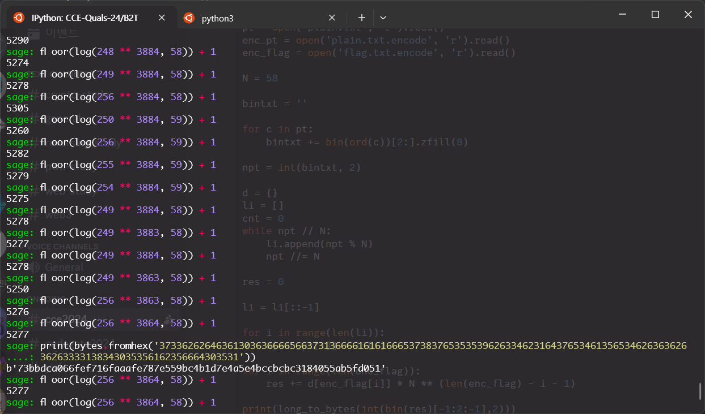

# B2T
## 개요
특정한 인코딩 방식을 이용해서 인코딩 한 텍스트 세트를 이용해, 플래그를 디코딩 시켜주면 된다.

## 풀이
문제 파일을 열어보면
flag.txt.encode, plain.txt, plain.txt.encode 이렇게 세 개의 파일이 주어진다.


plain.txt 파일 내에는 영어 지문이 들어있는데 문제에 대한 힌트는 전혀 없으므로 넘겨준다.

우리가 주목해야 하는 것은 plain.txt, plain.txt.encode 파일의 길이
plain.txt.encode 파일에 사용된 중복되지 않는 문자의 개수
이다.

1번을 구해보면 3864, 5277이 각각 나오는데 여기서 이 두 숫자 사이의 관계에서 힌트를 얻을 수 있다.

문제가 그렇게 어렵지 않을 것이므로 문제에서의 인코딩 방식은 base64와 유사한 일대일 대응, 치환으로 이루어짐을 추측할 수 있고 총 문자의 개수가 증가했으므로

ascii code의 기본 진법인 256진법보다 작은, 어떤 진법에 의해 치환이 이루어져있음을 추측할 수 있고 정확한 modular 값을 구해보면 58이 나오는 것을 확인할 수 있다.

(256진법으로 3884자리의 수는 58진법으로 5277자리의 수이다.)


두번째로 plain.txt.encode에 사용된 문자의 종류를 프로그램을 짜서 세어보면 총 58개임을 알 수 있다.

여기서 58진법으로 인코딩을 돌리는 것이 자명하구나, 라고 확신할 수 있고 big endian 방식으로 주어진 텍스트 파일을 숫자로 변환한 뒤 바로 58진법으로 변환하여 일대일 대응 쌍을 만들게 되면 문제가 풀릴 것이라 생각했다.

그러나 Base58 인코딩에 대한 조사를 하고 나서 알게 된 점인데, 58진법으로 변환 후 한 자리가 뒤에서 앞으로 당겨져 오게 된다. 이를 알지 못하는 상태에서 아래와 같은 방법으로 문제를 해결하였다.

## 1. 문자 및 숫자 배포 빈도 추출하기
``` Py
from Crypto.Util.number import *
from collections import Counter

pt = open('plain.txt', 'r').read()
enc_pt = open('plain.txt.encode', 'r').read()
enc_flag = open('flag.txt.encode', 'r').read()

N = 58

npt = int.from_bytes(pt.encode(), 'big')
assert long_to_bytes(npt) == pt.encode() and len(pt.encode()) == 3864

d = {}
li = []
cnt = 0
while npt // N:
    li.append(npt % N)
    npt //= N

res = 0

li = li[::-1]
print(li)
enc_count = Counter(enc_pt)
li_count = Counter(li)

print(enc_count, li_count)
```
Counter 객체를 이용해서 리스트와 문자열의 문자 중복을 확인하면 숫자 분포가 대응된다는 것을 확인할 수 있다.


여기서 우리의 방향성은 틀리지 않음을 알 수 있다.

## 2. 최빈 문자 배치 확인하기, 그리고 쉬프트
```py
ali = []
bli = []

for i in range(len(enc_pt)):
    if enc_pt[i] == '6':
        ali.append(i)

for i in range(len(li)):
    if li[i] == 53:
        bli.append(i)

print(ali, bli)
```

배열의 인덱스 차이가 1 남을 확인했다. 이후 코드만 짜주면 문제가 풀린다.

_ex.py_
```py
from Crypto.Util.number import *
from collections import Counter

pt = open('plain.txt', 'r').read()
enc_pt = open('plain.txt.encode', 'r').read()
enc_flag = open('flag.txt.encode', 'r').read()

N = 58

npt = int.from_bytes(pt.encode(), 'big')
assert long_to_bytes(npt) == pt.encode() and len(pt.encode()) == 3864

d = {}
li = []
cnt = 0
while npt // N:
    li.append(npt % N)
    npt //= N

res = 0

li = li[::-1]
print(li)
enc_count = Counter(enc_pt)
li_count = Counter(li)

print(enc_count, li_count)

ali = []
bli = []

for i in range(len(enc_pt)):
    if enc_pt[i] == '6':
        ali.append(i)

for i in range(len(li)):
    if li[i] == 53:
        bli.append(i)

print(ali, bli)

li = li[-1:] + li[:-1]

for i in range(len(li)):
    d[enc_pt[i]] = li[i]

for i in range(len(enc_flag)):
    res += d[enc_flag[i]] * N ** (len(enc_flag) - i - 1)

print(long_to_bytes(res))
```

☑ cce2024{Ev3n_biTC0in_Use5_B4s358_F0r_Bin4rY_tO_t3XT_EnC0dIng}